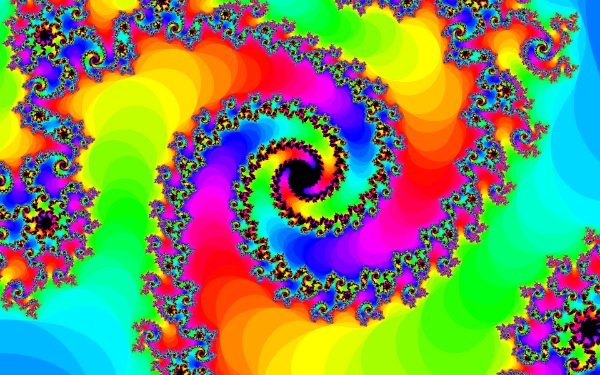
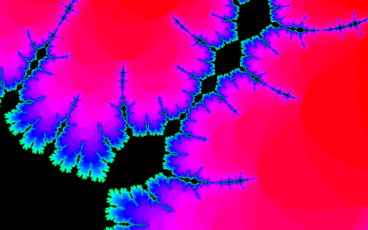

# Progressive Fractal Renderer

A progressive fractal renderer in pure javascript, with highly modifiable generation and colouring settings.
The fractal is rendered from the outside-in, and in that sense it progressively grows the fractal until the image no longer changes with increased iteration count. 

## Controls

- Left-click and drag to pan around the fractal.
- Scroll up to zoom in, down to zoom out.
- Hold *a* to move *c* around a circle of size 0.7885, or *d* to decrease it. 
- Press *w* to stop increasing iterations, and *e* to begin again if the fractal has not solved all pixels on-screen.
- Hold *r* to increase the radius of the circle, and *f* to decrease it. 
- Press *s* to switch rendering modes
  - '_#colour by iter_' colours each pixel by the number of iterations it takes to escape the circle
  - '_#colour by arg_' colours by the argument of the number which escapes the circle
  - '_#colour by mag_' colours by the magnitude of the number which escapes the circle
  - '_#colour by log iter_' colours by the logarithm of the number of iterations it takes to escape the circle

## Platform Support

This site is only tested on desktop, and is not expected to operate correctly on mobile.